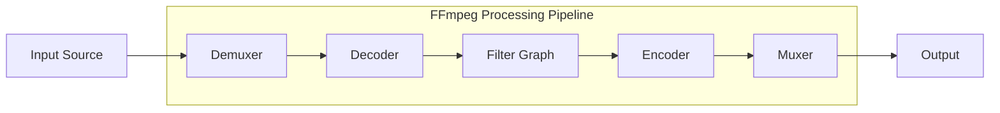
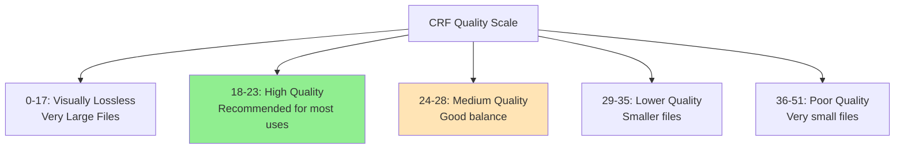

**FFmpeg** is a free and open-source software project consisting of a large suite of libraries and programs for handling video, audio, and other multimedia files and streams. This wiki serves as a comprehensive reference for FFmpeg commands and usage patterns.

## Quick Navigation

| Category            | Description                         | Jump To                     |
| ------------------- | ----------------------------------- | --------------------------- |
| **Basics**          | Installation, syntax, information   | [→](#basics)                |
| **Conversion**      | Format conversion and transcoding   | [→](#conversion)            |
| **Video**           | Video processing and manipulation   | [→](#video-processing)      |
| **Audio**           | Audio processing and effects        | [→](#audio-processing)      |
| **Editing**         | Cutting, merging, and basic editing | [→](#editing)               |
| **Streaming**       | Live streaming and adaptive formats | [→](#streaming)             |
| **Filters**         | Advanced filtering and effects      | [→](#filters)               |
| **Quality**         | Compression and quality control     | [→](#quality-control)       |
| **Hardware**        | Hardware acceleration options       | [→](#hardware-acceleration) |
| **Troubleshooting** | Common issues and solutions         | [→](#troubleshooting)       |

---

## Basics

### Installation

FFmpeg can be installed on various platforms:

- **Windows**: Download from [ffmpeg.org](https://ffmpeg.org/download.html) or use `winget install ffmpeg`
- **macOS**: `brew install ffmpeg`
- **Ubuntu/Debian**: `sudo apt install ffmpeg`
- **CentOS/RHEL**: `sudo yum install ffmpeg` or `sudo dnf install ffmpeg`

### Command Structure

```
ffmpeg [global_options] {[input_file_options] -i input_url} ... {[output_file_options] output_url} ...
```



### Basic Information Commands

| Command            | Purpose                 | Example                                                                    |
| ------------------ | ----------------------- | -------------------------------------------------------------------------- |
| `ffmpeg -i file`   | Show file information   | `ffmpeg -i video.mp4`                                                      |
| `ffprobe -i file`  | Detailed analysis       | `ffprobe -v quiet -print_format json -show_format -show_streams input.mp4` |
| `ffmpeg -formats`  | List supported formats  |                                                                            |
| `ffmpeg -codecs`   | List available codecs   |                                                                            |
| `ffmpeg -encoders` | List available encoders |                                                                            |
| `ffmpeg -filters`  | List available filters  |                                                                            |

---

## Conversion

### Container Format Conversion

#### Basic Conversions

```bash
# Change container without re-encoding (fastest)
ffmpeg -i input.mkv -c copy output.mp4

# Common format conversions
ffmpeg -i input.avi output.mp4
ffmpeg -i input.mov output.mp4
ffmpeg -i input.mkv -c copy output.mp4
ffmpeg -i input.flv output.mp4
```

#### Selective Stream Copying

```bash
# Copy video, re-encode audio
ffmpeg -i input.mkv -c:v copy -c:a aac output.mp4

# Copy audio, re-encode video
ffmpeg -i input.mkv -c:a copy -c:v libx264 output.mp4

# Copy specific stream
ffmpeg -i input.mkv -map 0:0 -c copy output_video_only.mp4
```

### Codec Conversion

#### Video Codecs

| Codec      | Command Flag      | Use Case                |
| ---------- | ----------------- | ----------------------- |
| H.264/AVC  | `-c:v libx264`    | Universal compatibility |
| H.265/HEVC | `-c:v libx265`    | Better compression      |
| VP9        | `-c:v libvpx-vp9` | Web streaming           |
| AV1        | `-c:v libaom-av1` | Next-gen compression    |

```bash
# H.264 encoding
ffmpeg -i input.mp4 -c:v libx264 -preset medium -crf 23 output.mp4

# H.265 encoding
ffmpeg -i input.mp4 -c:v libx265 -preset medium -crf 28 output.mp4

# VP9 for web
ffmpeg -i input.mp4 -c:v libvpx-vp9 -crf 30 -b:v 0 output.webm
```

#### Audio Codecs

| Codec | Command Flag      | Use Case                |
| ----- | ----------------- | ----------------------- |
| AAC   | `-c:a aac`        | Universal compatibility |
| MP3   | `-c:a libmp3lame` | Wide compatibility      |
| Opus  | `-c:a libopus`    | High efficiency         |
| FLAC  | `-c:a flac`       | Lossless compression    |

```bash
# Audio format conversions
ffmpeg -i input.wav -c:a libmp3lame -b:a 192k output.mp3
ffmpeg -i input.mp3 -c:a aac -b:a 128k output.aac
ffmpeg -i input.wav -c:a flac output.flac
ffmpeg -i input.wav -c:a libopus -b:a 96k output.opus
```

---

## Video Processing

### Resolution and Scaling

#### Basic Scaling

```bash
# Scale to specific resolution
ffmpeg -i input.mp4 -vf scale=1920:1080 output.mp4

# Scale maintaining aspect ratio
ffmpeg -i input.mp4 -vf scale=1920:-1 output.mp4  # Width fixed, height auto
ffmpeg -i input.mp4 -vf scale=-1:1080 output.mp4  # Height fixed, width auto

# Scale by percentage
ffmpeg -i input.mp4 -vf scale=iw*0.5:ih*0.5 output.mp4  # 50% size
```

#### Advanced Scaling

```bash
# Scale with padding to exact dimensions
ffmpeg -i input.mp4 -vf "scale=1920:1080:force_original_aspect_ratio=decrease,pad=1920:1080:-1:-1:black" output.mp4

# Scale with different algorithms
ffmpeg -i input.mp4 -vf scale=1920:1080:flags=lanczos output.mp4  # High quality
ffmpeg -i input.mp4 -vf scale=1920:1080:flags=fast_bilinear output.mp4  # Fast
```

#### Common Resolutions Reference

| Name   | Resolution | Command               |
| ------ | ---------- | --------------------- |
| 4K/UHD | 3840×2160  | `-vf scale=3840:2160` |
| 1440p  | 2560×1440  | `-vf scale=2560:1440` |
| 1080p  | 1920×1080  | `-vf scale=1920:1080` |
| 720p   | 1280×720   | `-vf scale=1280:720`  |
| 480p   | 854×480    | `-vf scale=854:480`   |
| 360p   | 640×360    | `-vf scale=640:360`   |

### Frame Rate Operations

```bash
# Change frame rate
ffmpeg -i input.mp4 -r 30 output.mp4

# Frame rate conversion with motion interpolation
ffmpeg -i input.mp4 -vf "fps=60" output.mp4

# Duplicate frames for higher frame rate
ffmpeg -i input.mp4 -vf "fps=fps=60:round=up" output.mp4

# Frame rate conversion with time adjustment
ffmpeg -i input.mp4 -vf "setpts=PTS*0.5" -r 60 output.mp4  # Double speed, double FPS
```

### Video Rotation and Flip

```bash
# Rotate 90 degrees clockwise
ffmpeg -i input.mp4 -vf "transpose=1" output.mp4

# Rotate 90 degrees counter-clockwise
ffmpeg -i input.mp4 -vf "transpose=2" output.mp4

# Rotate 180 degrees
ffmpeg -i input.mp4 -vf "transpose=2,transpose=2" output.mp4

# Flip horizontally
ffmpeg -i input.mp4 -vf hflip output.mp4

# Flip vertically
ffmpeg -i input.mp4 -vf vflip output.mp4
```

### Color and Image Adjustments

```bash
# Adjust brightness
ffmpeg -i input.mp4 -vf "eq=brightness=0.2" output.mp4

# Adjust contrast
ffmpeg -i input.mp4 -vf "eq=contrast=1.5" output.mp4

# Adjust saturation
ffmpeg -i input.mp4 -vf "eq=saturation=1.5" output.mp4

# Combined adjustments
ffmpeg -i input.mp4 -vf "eq=brightness=0.1:contrast=1.2:saturation=1.1" output.mp4

# Convert to grayscale
ffmpeg -i input.mp4 -vf "format=gray" output.mp4
```

---

## Audio Processing

### Audio Extraction and Conversion

```bash
# Extract audio from video
ffmpeg -i input.mp4 -vn -acodec copy output.aac
ffmpeg -i input.mp4 -vn -c:a libmp3lame -b:a 192k output.mp3

# Convert audio formats
ffmpeg -i input.wav -c:a libmp3lame -b:a 320k output.mp3
ffmpeg -i input.mp3 -c:a aac -b:a 128k output.aac
ffmpeg -i input.wav -c:a flac output.flac
```

### Audio Quality Settings

#### Bitrate Reference

| Quality Level | MP3  | AAC  | Opus |
| ------------- | ---- | ---- | ---- |
| Low           | 128k | 96k  | 64k  |
| Medium        | 192k | 128k | 96k  |
| High          | 256k | 192k | 128k |
| Very High     | 320k | 256k | 160k |

```bash
# Quality settings
ffmpeg -i input.wav -c:a libmp3lame -b:a 192k output.mp3  # Medium quality MP3
ffmpeg -i input.wav -c:a aac -b:a 128k output.aac  # Medium quality AAC
ffmpeg -i input.wav -c:a libopus -b:a 96k output.opus  # Medium quality Opus
```

### Audio Effects

```bash
# Volume adjustment
ffmpeg -i input.mp3 -filter:a "volume=2.0" output.mp3  # Double volume
ffmpeg -i input.mp3 -filter:a "volume=0.5" output.mp3  # Half volume
ffmpeg -i input.mp3 -filter:a "volume=10dB" output.mp3  # Increase by 10dB

# Audio normalization
ffmpeg -i input.mp3 -filter:a "loudnorm" output.mp3

# Fade effects
ffmpeg -i input.mp3 -filter:a "afade=in:st=0:d=5" output.mp3  # 5s fade in
ffmpeg -i input.mp3 -filter:a "afade=out:st=55:d=5" output.mp3  # 5s fade out
ffmpeg -i input.mp3 -filter:a "afade=in:st=0:d=3,afade=out:st=57:d=3" output.mp3  # Both

# Channel manipulation
ffmpeg -i input.wav -ac 1 output.wav  # Convert to mono
ffmpeg -i input.wav -ac 2 output.wav  # Convert to stereo

# Sample rate conversion
ffmpeg -i input.wav -ar 44100 output.wav  # CD quality
ffmpeg -i input.wav -ar 48000 output.wav  # Professional quality
```

---

## Editing

### Trimming and Cutting

#### Time-based Cutting

```bash
# Cut from 30s for 60s duration
ffmpeg -ss 00:00:30 -t 00:01:00 -i input.mp4 -c copy output.mp4

# Cut from start to 2 minutes
ffmpeg -t 00:02:00 -i input.mp4 -c copy output.mp4

# Cut from 1 minute to end
ffmpeg -ss 00:01:00 -i input.mp4 -c copy output.mp4

# Multiple segments
ffmpeg -i input.mp4 -ss 00:01:00 -t 00:00:30 -c copy segment1.mp4
ffmpeg -i input.mp4 -ss 00:02:00 -t 00:00:30 -c copy segment2.mp4
```

#### Precise Cutting (Re-encoding)

```bash
# Frame-accurate cutting (slower but precise)
ffmpeg -ss 00:01:30.500 -t 00:00:30.250 -i input.mp4 -c:v libx264 -crf 23 output.mp4

# Cut by frame number (25fps video)
ffmpeg -i input.mp4 -vf "select=between(n\,750\,1500)" -vsync 0 output.mp4
```

### Concatenation

#### Simple Concatenation (Same Format)

Create `filelist.txt`:

```
file 'video1.mp4'
file 'video2.mp4'
file 'video3.mp4'
```

```bash
# Concatenate without re-encoding
ffmpeg -f concat -safe 0 -i filelist.txt -c copy output.mp4

# Concatenate with re-encoding
ffmpeg -f concat -safe 0 -i filelist.txt -c:v libx264 -crf 23 output.mp4
```

#### Complex Concatenation (Different Formats)

```bash
# Concatenate different formats
ffmpeg -i video1.mp4 -i video2.avi -filter_complex "[0:v][0:a][1:v][1:a]concat=n=2:v=1:a=1[outv][outa]" -map "[outv]" -map "[outa]" output.mp4
```

### Watermarks and Overlays

```bash
# Image watermark (top-left corner)
ffmpeg -i input.mp4 -i watermark.png -filter_complex "overlay=10:10" output.mp4

# Image watermark (bottom-right corner)
ffmpeg -i input.mp4 -i watermark.png -filter_complex "overlay=main_w-overlay_w-10:main_h-overlay_h-10" output.mp4

# Text watermark
ffmpeg -i input.mp4 -vf "drawtext=text='Copyright 2024':fontcolor=white:fontsize=24:x=10:y=10" output.mp4

# Dynamic timestamp
ffmpeg -i input.mp4 -vf "drawtext=text='%{localtime}':fontcolor=white:fontsize=20:x=10:y=10" output.mp4

# Semi-transparent watermark
ffmpeg -i input.mp4 -i watermark.png -filter_complex "[1:v]colorchannelmixer=aa=0.5[watermark];[0:v][watermark]overlay=10:10" output.mp4
```

### Thumbnails and Screenshots

```bash
# Single thumbnail at specific time
ffmpeg -ss 00:00:10 -i input.mp4 -vframes 1 -q:v 2 thumbnail.jpg

# Multiple thumbnails
ffmpeg -i input.mp4 -vf "fps=1/10" thumb_%04d.jpg  # One every 10 seconds

# Thumbnail contact sheet
ffmpeg -i input.mp4 -vf "select=not(mod(n\,1000)),scale=320:240,tile=4x3" contact_sheet.jpg

# High-quality thumbnail
ffmpeg -ss 00:01:00 -i input.mp4 -vframes 1 -q:v 1 -s 1920x1080 thumb.jpg
```

---

## Quality Control

### CRF (Constant Rate Factor)

The CRF scale ranges from 0-51 where lower values mean better quality:



#### CRF Examples

```bash
# Visually lossless (archival quality)
ffmpeg -i input.mp4 -c:v libx264 -crf 17 -preset slow output.mp4

# High quality (recommended)
ffmpeg -i input.mp4 -c:v libx264 -crf 23 -preset medium output.mp4

# Web streaming quality
ffmpeg -i input.mp4 -c:v libx264 -crf 28 -preset fast output.mp4

# Mobile/low bandwidth
ffmpeg -i input.mp4 -c:v libx264 -crf 32 -preset fast output.mp4
```

### Encoding Presets

| Preset    | Speed     | Compression | Use Case                |
| --------- | --------- | ----------- | ----------------------- |
| ultrafast | Fastest   | Poor        | Real-time encoding      |
| superfast | Very Fast | Poor        | Live streaming          |
| veryfast  | Fast      | Fair        | Quick processing        |
| faster    | Fast      | Good        | General use             |
| fast      | Medium    | Good        | Balanced                |
| medium    | Medium    | Better      | **Default/Recommended** |
| slow      | Slow      | Better      | High quality            |
| slower    | Very Slow | Best        | Archival                |
| veryslow  | Slowest   | Best        | Maximum compression     |

### Bitrate Control

```bash
# Constant bitrate (CBR)
ffmpeg -i input.mp4 -b:v 2M -minrate 2M -maxrate 2M -bufsize 1M output.mp4

# Average bitrate (ABR)
ffmpeg -i input.mp4 -b:v 2M output.mp4

# Variable bitrate with maximum
ffmpeg -i input.mp4 -b:v 2M -maxrate 4M -bufsize 2M output.mp4

# Two-pass encoding for precise file size
ffmpeg -i input.mp4 -c:v libx264 -b:v 2M -pass 1 -f null /dev/null
ffmpeg -i input.mp4 -c:v libx264 -b:v 2M -pass 2 output.mp4
```

---

## Streaming

### HTTP Live Streaming (HLS)

```bash
# Basic HLS stream
ffmpeg -i input.mp4 \
  -c:v libx264 -crf 23 -preset medium \
  -c:a aac -b:a 128k \
  -hls_time 10 \
  -hls_list_size 0 \
  -hls_segment_filename "segment_%03d.ts" \
  playlist.m3u8

# Multi-bitrate HLS (adaptive streaming)
ffmpeg -i input.mp4 \
  -map 0:v -map 0:a -map 0:v -map 0:a -map 0:v -map 0:a \
  -c:v libx264 -crf 22 -c:a aac \
  -b:v:0 6M -s:v:0 1920x1080 -profile:v:0 high \
  -b:v:1 3M -s:v:1 1280x720 -profile:v:1 high \
  -b:v:2 1M -s:v:2 854x480 -profile:v:2 main \
  -b:a:0 128k -b:a:1 128k -b:a:2 96k \
  -var_stream_map "v:0,a:0 v:1,a:1 v:2,a:2" \
  -master_pl_name master.m3u8 \
  -hls_time 6 -hls_list_size 0 \
  stream_%v.m3u8
```

### DASH (Dynamic Adaptive Streaming)

```bash
# Basic DASH stream
ffmpeg -i input.mp4 \
  -map 0:v -map 0:a \
  -c:v libx264 -preset medium -crf 23 \
  -c:a aac -b:a 128k \
  -f dash \
  -seg_duration 4 \
  -use_template 1 \
  -use_timeline 1 \
  manifest.mpd
```

### Live Streaming (RTMP)

```bash
# Stream to RTMP server (Twitch, YouTube, etc.)
ffmpeg -i input.mp4 \
  -c:v libx264 -preset veryfast -maxrate 3000k -bufsize 6000k \
  -pix_fmt yuv420p -g 50 \
  -c:a aac -b:a 160k -ac 2 -ar 44100 \
  -f flv rtmp://live.twitch.tv/live/YOUR_STREAM_KEY

# Live webcam streaming
ffmpeg -f v4l2 -i /dev/video0 \
  -c:v libx264 -preset veryfast -b:v 2500k -maxrate 2500k -bufsize 5000k \
  -pix_fmt yuv420p -g 60 \
  -c:a aac -b:a 128k -ar 44100 \
  -f flv rtmp://live.twitch.tv/live/YOUR_STREAM_KEY
```

---

## Filters

### Basic Filters

#### Video Filters

```bash
# Blur
ffmpeg -i input.mp4 -vf "boxblur=5:1" output.mp4

# Sharpen
ffmpeg -i input.mp4 -vf "unsharp=5:5:1.0:5:5:0.0" output.mp4

# Denoise
ffmpeg -i input.mp4 -vf "hqdn3d" output.mp4

# Deinterlace
ffmpeg -i input.mp4 -vf "yadif" output.mp4
```

#### Audio Filters

```bash
# High-pass filter
ffmpeg -i input.mp3 -af "highpass=f=200" output.mp3

# Low-pass filter
ffmpeg -i input.mp3 -af "lowpass=f=3000" output.mp3

# Equalizer
ffmpeg -i input.mp3 -af "equalizer=f=1000:width_type=h:width=200:g=10" output.mp3
```

### Complex Filters

```bash
# Picture-in-picture
ffmpeg -i main.mp4 -i overlay.mp4 \
  -filter_complex "[1:v]scale=320:240[pip];[0:v][pip]overlay=W-w-10:10" \
  output.mp4

# Side-by-side comparison
ffmpeg -i left.mp4 -i right.mp4 \
  -filter_complex "[0:v][1:v]hstack=inputs=2[out]" \
  -map "[out]" output.mp4

# Green screen (chroma key)
ffmpeg -i greenscreen.mp4 -i background.mp4 \
  -filter_complex "[0:v]colorkey=0x00ff00:0.3:0.2[keyed];[1:v][keyed]overlay" \
  output.mp4

# Speed effects
ffmpeg -i input.mp4 -filter:v "setpts=0.5*PTS" -filter:a "atempo=2.0" output.mp4  # 2x speed
ffmpeg -i input.mp4 -filter:v "setpts=2.0*PTS" -filter:a "atempo=0.5" output.mp4  # 0.5x speed
```

### Creating GIFs

```bash
# Basic GIF conversion
ffmpeg -i input.mp4 -vf "fps=10,scale=320:-1:flags=lanczos,palettegen" palette.png
ffmpeg -i input.mp4 -i palette.png -filter_complex "fps=10,scale=320:-1:flags=lanczos[x];[x][1:v]paletteuse" output.gif

# High-quality GIF with custom palette
ffmpeg -ss 10 -t 5 -i input.mp4 \
  -vf "fps=15,scale=480:-1:flags=lanczos,split[s0][s1];[s0]palettegen[p];[s1][p]paletteuse" \
  output.gif

# Optimized GIF for web
ffmpeg -i input.mp4 -vf "fps=12,scale=320:-1:flags=lanczos,split[s0][s1];[s0]palettegen=max_colors=64[p];[s1][p]paletteuse=dither=bayer" output.gif
```

---

## Hardware Acceleration

### GPU Acceleration Support

| GPU    | Encoder                              | Decoder                | Platforms      |
| ------ | ------------------------------------ | ---------------------- | -------------- |
| NVIDIA | h264_nvenc, hevc_nvenc               | h264_cuvid, hevc_cuvid | Windows, Linux |
| Intel  | h264_qsv, hevc_qsv                   | h264_qsv, hevc_qsv     | Windows, Linux |
| AMD    | h264_amf, hevc_amf                   | -                      | Windows        |
| Apple  | h264_videotoolbox, hevc_videotoolbox | -                      | macOS          |

### NVIDIA GPU Acceleration

```bash
# Hardware-accelerated encoding
ffmpeg -hwaccel cuda -i input.mp4 -c:v h264_nvenc -preset fast -crf 23 output.mp4

# Hardware-accelerated decoding and encoding
ffmpeg -hwaccel cuda -hwaccel_output_format cuda -i input.mp4 -c:v h264_nvenc -preset fast output.mp4

# HEVC encoding
ffmpeg -hwaccel cuda -i input.mp4 -c:v hevc_nvenc -preset fast -crf 28 output.mp4
```

### Intel Quick Sync (QSV)

```bash
# Intel QSV encoding
ffmpeg -hwaccel qsv -i input.mp4 -c:v h264_qsv -preset fast -global_quality 23 output.mp4

# HEVC with QSV
ffmpeg -hwaccel qsv -i input.mp4 -c:v hevc_qsv -preset fast -global_quality 28 output.mp4
```

### Apple VideoToolbox (macOS)

```bash
# Hardware encoding on macOS
ffmpeg -hwaccel videotoolbox -i input.mp4 -c:v h264_videotoolbox -b:v 2M output.mp4

# HEVC encoding
ffmpeg -hwaccel videotoolbox -i input.mp4 -c:v hevc_videotoolbox -b:v 1.5M output.mp4
```

---

## Troubleshooting

### Common Issues and Solutions

#### Codec Compatibility

```bash
# Check if codec is supported
ffmpeg -encoders | grep h264

# Force specific profile for compatibility
ffmpeg -i input.mp4 -c:v libx264 -profile:v baseline -level 3.0 output.mp4

# Ensure pixel format compatibility
ffmpeg -i input.mp4 -pix_fmt yuv420p output.mp4
```

#### Audio/Video Sync Issues

```bash
# Fix A/V sync issues
ffmpeg -i input.mp4 -async 1 output.mp4

# Manually adjust audio delay (positive = delay audio)
ffmpeg -i input.mp4 -itsoffset 0.5 -i input.mp4 -map 0:v -map 1:a -c copy output.mp4

# Fix frame rate mismatches
ffmpeg -i input.mp4 -r 25 -video_track_timescale 25000 output.mp4
```

#### File Size and Performance

```bash
# Optimize for streaming (web)
ffmpeg -i input.mp4 -movflags +faststart -c:v libx264 -crf 28 output.mp4

# Reduce memory usage for large files
ffmpeg -i input.mp4 -max_muxing_queue_size 1024 output.mp4

# Multi-threading optimization
ffmpeg -threads 0 -i input.mp4 output.mp4  # Use all cores
```

### Error Diagnostics

```bash
# Verbose logging
ffmpeg -v verbose -i input.mp4 output.mp4

# Debug mode
ffmpeg -v debug -i input.mp4 output.mp4

# Show progress
ffmpeg -progress pipe:1 -i input.mp4 output.mp4

# Test without output
ffmpeg -f null - -i input.mp4
```

### Performance Monitoring

```bash
# Show encoding speed and stats
ffmpeg -i input.mp4 -c:v libx264 -preset medium -crf 23 -stats output.mp4

# Benchmark encoding presets
time ffmpeg -i input.mp4 -c:v libx264 -preset ultrafast -f null -
time ffmpeg -i input.mp4 -c:v libx264 -preset medium -f null -
time ffmpeg -i input.mp4 -c:v libx264 -preset slow -f null -
```

---

## Reference Tables

### Common File Formats and Extensions

| Container | Video Codecs      | Audio Codecs | Use Case                       |
| --------- | ----------------- | ------------ | ------------------------------ |
| MP4       | H.264, H.265, AV1 | AAC, MP3     | Universal compatibility        |
| MKV       | Any               | Any          | High quality, multiple streams |
| WebM      | VP8, VP9, AV1     | Vorbis, Opus | Web streaming                  |
| AVI       | Various           | Various      | Legacy compatibility           |
| MOV       | H.264, ProRes     | AAC, PCM     | Apple ecosystem                |
| FLV       | H.264, VP6        | AAC, MP3     | Legacy streaming               |

### Quality Presets by Use Case

| Use Case          | Video Settings                                          | Audio Settings             |
| ----------------- | ------------------------------------------------------- | -------------------------- |
| **Archival**      | `-c:v libx264 -preset slow -crf 17`                     | `-c:a flac`                |
| **High Quality**  | `-c:v libx264 -preset medium -crf 23`                   | `-c:a aac -b:a 192k`       |
| **Web Streaming** | `-c:v libx264 -preset fast -crf 28`                     | `-c:a aac -b:a 128k`       |
| **Mobile**        | `-c:v libx264 -preset fast -crf 32 -profile:v baseline` | `-c:a aac -b:a 96k`        |
| **Social Media**  | Platform-specific settings                              | Platform-specific settings |

### Platform-Specific Optimizations

#### YouTube

```bash
ffmpeg -i input.mp4 \
  -c:v libx264 -preset slow -crf 18 \
  -c:a aac -b:a 192k \
  -pix_fmt yuv420p \
  -movflags +faststart \
  youtube_upload.mp4
```

#### Instagram

```bash
# Instagram feed (1:1 square)
ffmpeg -i input.mp4 \
  -c:v libx264 -preset medium -crf 28 \
  -vf "scale=1080:1080:force_original_aspect_ratio=decrease,pad=1080:1080:-1:-1:black" \
  -c:a aac -b:a 128k \
  -t 60 \
  instagram_feed.mp4

# Instagram Stories (9:16)
ffmpeg -i input.mp4 \
  -c:v libx264 -preset medium -crf 28 \
  -vf "scale=1080:1920:force_original_aspect_ratio=decrease,pad=1080:1920:-1:-1:black" \
  -c:a aac -b:a 128k \
  -t 15 \
  instagram_story.mp4
```

#### TikTok

```bash
ffmpeg -i input.mp4 \
  -c:v libx264 -preset medium -crf 28 \
  -vf "scale=1080:1920:force_original_aspect_ratio=decrease,pad=1080:1920:-1:-1:black" \
  -c:a aac -b:a 128k \
  -r 30 -t 60 \
  tiktok_upload.mp4
```

#### Twitter

```bash
ffmpeg -i input.mp4 \
  -c:v libx264 -preset medium -crf 28 \
  -vf "scale=1280:720" \
  -c:a aac -b:a 128k \
  -t 140 \
  twitter_upload.mp4
```

---

## Batch Processing and Automation

### Shell Scripts for Batch Operations

#### Convert All Videos in Directory

```bash
#!/bin/bash
# Convert all MP4 files to WebM
for file in *.mp4; do
  if [[ -f "$file" ]]; then
    output="${file%.*}.webm"
    echo "Converting $file to $output"
    ffmpeg -i "$file" -c:v libvpx-vp9 -crf 30 -c:a libopus -b:a 128k "$output"
  fi
done
```

#### Batch Thumbnail Generation

```bash
#!/bin/bash
# Generate thumbnails for all videos
for file in *.{mp4,mkv,avi,mov}; do
  if [[ -f "$file" ]]; then
    thumb="${file%.*}_thumb.jpg"
    echo "Generating thumbnail for $file"
    ffmpeg -ss 00:00:10 -i "$file" -vframes 1 -q:v 2 -s 320x240 "$thumb"
  fi
done
```

#### Quality Comparison Script

```bash
#!/bin/bash
# Compare different CRF values
input="$1"
if [[ -z "$input" ]]; then
  echo "Usage: $0 input_video.mp4"
  exit 1
fi

for crf in 18 23 28 32; do
  output="${input%.*}_crf${crf}.mp4"
  echo "Encoding with CRF $crf..."
  ffmpeg -i "$input" -c:v libx264 -preset medium -crf "$crf" -c:a aac -b:a 128k "$output"
  size=$(du -h "$output" | cut -f1)
  echo "CRF $crf: $size"
done
```

### PowerShell Scripts (Windows)

```powershell
# Convert all videos in current directory
Get-ChildItem -Filter "*.mp4" | ForEach-Object {
    $output = $_.BaseName + "_converted.mp4"
    ffmpeg -i $_.Name -c:v libx264 -crf 28 -c:a aac -b:a 128k $output
}
```

---

## Advanced Topics

### Custom Encoding Profiles

#### Create Reusable Presets

```bash
# Create a custom preset file (~/.ffmpeg/libx264-mypreset.ffpreset)
vcodec=libx264
vb=2000k
preset=medium
crf=23
pix_fmt=yuv420p

# Use the preset
ffmpeg -i input.mp4 -vpre mypreset output.mp4
```

### Network Streaming

#### UDP Streaming

```bash
# Send stream via UDP
ffmpeg -re -i input.mp4 -c copy -f mpegts udp://192.168.1.100:1234

# Receive UDP stream
ffmpeg -i udp://localhost:1234 -c copy output.mp4
```

#### HTTP Streaming

```bash
# Create HTTP stream
ffmpeg -re -i input.mp4 -c copy -f flv http://localhost:8080/live/stream

# Stream to multiple outputs
ffmpeg -i input.mp4 \
  -c:v libx264 -preset veryfast -b:v 3000k -maxrate 3000k -bufsize 6000k -f flv rtmp://server1/live/key \
  -c:v libx264 -preset veryfast -b:v 1500k -maxrate 1500k -bufsize 3000k -s 1280x720 -f flv rtmp://server2/live/key
```

### Subtitle Handling

#### Extract Subtitles

```bash
# Extract all subtitles
ffmpeg -i input.mkv -map 0:s subtitle.srt

# Extract specific subtitle track
ffmpeg -i input.mkv -map 0:s:0 subtitle_eng.srt
ffmpeg -i input.mkv -map 0:s:1 subtitle_spa.srt
```

#### Burn Subtitles into Video

```bash
# Burn SRT subtitles
ffmpeg -i input.mp4 -vf "subtitles=subtitle.srt" output.mp4

# Burn subtitles from video file
ffmpeg -i input.mkv -vf "subtitles=input.mkv:si=0" output.mp4

# Custom subtitle styling
ffmpeg -i input.mp4 -vf "subtitles=subtitle.srt:force_style='FontName=Arial,FontSize=24,PrimaryColour=&H00ff00'" output.mp4
```

#### Add Soft Subtitles

```bash
# Add subtitle track to video
ffmpeg -i input.mp4 -i subtitle.srt -c copy -c:s mov_text -metadata:s:s:0 language=eng output.mp4

# Multiple subtitle tracks
ffmpeg -i input.mp4 -i eng.srt -i spa.srt -c copy -c:s mov_text \
  -metadata:s:s:0 language=eng -metadata:s:s:1 language=spa output.mp4
```

### Audio Synchronization and Mixing

#### Multi-channel Audio Processing

```bash
# Extract specific audio channels
ffmpeg -i input.mp4 -af "pan=mono|c0=0.5*c0+0.5*c1" output.mp4  # Stereo to mono
ffmpeg -i input.mp4 -af "pan=stereo|c0=c0|c1=c0" output.mp4     # Left channel to both

# Audio channel mapping
ffmpeg -i input.mp4 -map_channel 0.1.0 -map_channel 0.1.1 output.mp4

# 5.1 to stereo downmix
ffmpeg -i input.mp4 -af "pan=stereo|FL=0.5*FC+0.707*FL+0.707*BL+0.5*LFE|FR=0.5*FC+0.707*FR+0.707*BR+0.5*LFE" output.mp4
```

#### Audio Mixing

```bash
# Mix two audio sources
ffmpeg -i video.mp4 -i audio.mp3 -filter_complex "[0:a][1:a]amix=inputs=2[aout]" -map 0:v -map "[aout]" output.mp4

# Adjust audio levels in mix
ffmpeg -i video.mp4 -i music.mp3 -filter_complex "[0:a]volume=0.8[a1];[1:a]volume=0.3[a2];[a1][a2]amix=inputs=2[aout]" -map 0:v -map "[aout]" output.mp4

# Add background music with ducking
ffmpeg -i speech.mp4 -i music.mp3 -filter_complex "[1:a]volume=0.2[bg];[0:a][bg]amix=inputs=2[aout]" -map 0:v -map "[aout]" output.mp4
```

---

## Performance Optimization

### Memory and CPU Usage

#### Optimize for Large Files

```bash
# Limit memory usage
ffmpeg -i input.mp4 -max_muxing_queue_size 1024 -c:v libx264 -crf 28 output.mp4

# Process in chunks for very large files
ffmpeg -ss 0 -t 3600 -i huge_input.mp4 -c copy part1.mp4
ffmpeg -ss 3600 -t 3600 -i huge_input.mp4 -c copy part2.mp4
# Then concatenate parts
```

#### Multi-threading Configuration

```bash
# Automatic thread detection
ffmpeg -threads 0 -i input.mp4 -c:v libx264 -preset medium output.mp4

# Manual thread count
ffmpeg -threads 8 -i input.mp4 -c:v libx264 -preset medium output.mp4

# Encoder-specific threading
ffmpeg -i input.mp4 -c:v libx264 -preset medium -threads 4 -thread_type slice output.mp4
```

### Storage Optimization

#### Temporary File Management

```bash
# Use RAM disk for temporary files (Linux)
export TMPDIR=/tmp/ramdisk
ffmpeg -i input.mp4 -c:v libx264 -pass 1 output.mp4
ffmpeg -i input.mp4 -c:v libx264 -pass 2 output.mp4

# Specify temporary directory
ffmpeg -i input.mp4 -c:v libx264 -pass 1 -passlogfile /tmp/ffmpeg_pass output.mp4
```

---

## Quality Analysis and Testing

### Video Quality Metrics

#### PSNR (Peak Signal-to-Noise Ratio)

```bash
# Calculate PSNR between original and compressed
ffmpeg -i original.mp4 -i compressed.mp4 -lavfi "psnr" -f null -
```

#### SSIM (Structural Similarity Index)

```bash
# Calculate SSIM
ffmpeg -i original.mp4 -i compressed.mp4 -lavfi "ssim" -f null -
```

#### VMAF (Video Multi-Method Assessment Fusion)

```bash
# Calculate VMAF score (requires VMAF model)
ffmpeg -i compressed.mp4 -i original.mp4 -lavfi "libvmaf=model_path=/path/to/model.json" -f null -
```

### File Analysis Tools

#### MediaInfo Integration

```bash
# Get detailed file information
mediainfo input.mp4

# JSON output
mediainfo --Output=JSON input.mp4

# Specific parameters
mediainfo --Inform="Video;%Width%x%Height% %FrameRate% fps %BitRate% bps" input.mp4
```

#### Custom Analysis Scripts

```bash
#!/bin/bash
# Analyze multiple files
echo "Filename,Width,Height,Duration,Bitrate,Size" > analysis.csv
for file in *.mp4; do
  if [[ -f "$file" ]]; then
    info=$(ffprobe -v quiet -select_streams v:0 -show_entries stream=width,height,bit_rate -show_entries format=duration -of csv=p=0 "$file")
    size=$(du -b "$file" | cut -f1)
    echo "$file,$info,$size" >> analysis.csv
  fi
done
```

---

## Specialized Use Cases

### Security and Surveillance

#### Motion Detection Recording

```bash
# Record only when motion is detected
ffmpeg -i rtsp://camera/stream -vf "select='gt(scene,0.003)'" -vsync vfr motion_detected.mp4
```

#### Time-lapse Creation

```bash
# Create time-lapse from images
ffmpeg -framerate 30 -pattern_type glob -i '*.jpg' -c:v libx264 -pix_fmt yuv420p timelapse.mp4

# Time-lapse from video (speed up 10x)
ffmpeg -i input.mp4 -filter:v "setpts=0.1*PTS" -an timelapse.mp4
```

### Audio Production

#### Podcast Processing

```bash
# Standard podcast processing chain
ffmpeg -i raw_podcast.wav \
  -af "highpass=f=80,lowpass=f=10000,compand=attacks=0.002:decays=0.05:points=-60/-60:-30/-15:-20/-10:-12/-8:-6/-6:-2/-2:0/0,loudnorm=I=-16:LRA=11:TP=-1.5" \
  -c:a libmp3lame -b:a 128k \
  podcast_processed.mp3
```

#### Music Production

```bash
# High-quality music conversion
ffmpeg -i input.wav -c:a flac -compression_level 8 output.flac

# Apply fade in/out for music tracks
ffmpeg -i music.wav -af "afade=in:st=0:d=2,afade=out:st=178:d=2" music_faded.wav
```

### Broadcasting and Professional Video

#### Broadcast-safe Processing

```bash
# Ensure broadcast-safe levels
ffmpeg -i input.mp4 \
  -vf "scale=1920:1080,fps=25,format=yuv420p" \
  -c:v libx264 -profile:v high -level 4.0 \
  -b:v 50M -maxrate 50M -bufsize 25M \
  -c:a pcm_s16le -ar 48000 -ac 2 \
  broadcast_safe.mov
```

#### Color Space Conversion

```bash
# Convert color space
ffmpeg -i input.mp4 -vf "colorspace=bt709:bt2020" -c:v libx264 output.mp4

# Apply color correction
ffmpeg -i input.mp4 -vf "curves=vintage" -c:v libx264 output.mp4
```

---

## Integration and Workflows

### Integration with Other Tools

#### ImageMagick Integration

```bash
# Create video from processed images
convert *.jpg -resize 1920x1080 processed_%04d.jpg
ffmpeg -framerate 30 -i processed_%04d.jpg -c:v libx264 -pix_fmt yuv420p video.mp4
```

#### Python Integration

```python
import subprocess
import os

def convert_video(input_file, output_file, crf=23):
    cmd = [
        'ffmpeg', '-i', input_file,
        '-c:v', 'libx264', '-crf', str(crf),
        '-c:a', 'aac', '-b:a', '128k',
        '-y', output_file
    ]
    subprocess.run(cmd, check=True)

# Batch process directory
for filename in os.listdir('input/'):
    if filename.endswith('.mp4'):
        input_path = os.path.join('input', filename)
        output_path = os.path.join('output', f'processed_{filename}')
        convert_video(input_path, output_path)
```

---

## Maintenance and Updates

### Version Management

```bash
# Check FFmpeg version and capabilities
ffmpeg -version
ffmpeg -buildconf

# Check for specific codec support
ffmpeg -encoders | grep x264
ffmpeg -decoders | grep hevc
```

### Regular Maintenance Tasks

```bash
# Clean temporary files
find /tmp -name "ffmpeg*" -type f -delete

# Verify installation integrity
ffmpeg -f lavfi -i testsrc=duration=1:size=320x240:rate=1 -f null -
```

---

## Resources and Documentation

### Official Documentation

- **FFmpeg Official Website**: [ffmpeg.org](https://ffmpeg.org/)
- **FFmpeg Documentation**: [ffmpeg.org/ffmpeg.html](https://ffmpeg.org/ffmpeg.html)
- **FFplay Documentation**: [ffmpeg.org/ffplay.html](https://ffmpeg.org/ffplay.html)
- **FFprobe Documentation**: [ffmpeg.org/ffprobe.html](https://ffmpeg.org/ffprobe.html)

### Community Resources

- **FFmpeg Wiki**: Community-maintained documentation
- **VideoHelp Forum**: User discussions and solutions
- **Stack Overflow**: Programming-related questions
- **Reddit r/ffmpeg**: Community discussions and help

### Development and Source Code

- **Git Repository**: [git.ffmpeg.org](https://git.ffmpeg.org/ffmpeg.git)
- **Issue Tracker**: [trac.ffmpeg.org](https://trac.ffmpeg.org/)
- **Mailing Lists**: Developer and user mailing lists

---

## Glossary

| Term            | Definition                                                                           |
| --------------- | ------------------------------------------------------------------------------------ |
| **Bitrate**     | Amount of data processed per unit of time, usually measured in bits per second (bps) |
| **Codec**       | Algorithm for encoding and decoding digital data streams                             |
| **Container**   | File format that can hold multiple data streams (video, audio, subtitles)            |
| **CRF**         | Constant Rate Factor - quality-based encoding mode                                   |
| **Demuxer**     | Component that separates streams from container format                               |
| **Filter**      | Component that processes audio or video data                                         |
| **GOP**         | Group of Pictures - sequence of frames in video compression                          |
| **Keyframe**    | Reference frame that can be decoded independently                                    |
| **Muxer**       | Component that combines streams into container format                                |
| **Preset**      | Pre-configured encoding settings for balance of speed vs compression                 |
| **Profile**     | Subset of codec features for compatibility with specific devices                     |
| **Stream**      | Individual data track (video, audio, subtitle) within a container                    |
| **Transcoding** | Process of converting from one codec/format to another                               |

---

## Quick Reference Cards

### Most Common Commands

```bash
# Basic conversion
ffmpeg -i input.mp4 output.avi

# High-quality encoding
ffmpeg -i input.mp4 -c:v libx264 -crf 23 -c:a aac -b:a 128k output.mp4

# Extract audio
ffmpeg -i input.mp4 -vn -c:a copy audio.aac

# Cut video
ffmpeg -ss 00:01:00 -t 00:02:00 -i input.mp4 -c copy output.mp4

# Scale video
ffmpeg -i input.mp4 -vf scale=1280:720 output.mp4

# Convert to GIF
ffmpeg -i input.mp4 -vf "fps=10,scale=320:-1:flags=lanczos,palettegen" palette.png
ffmpeg -i input.mp4 -i palette.png -filter_complex "fps=10,scale=320:-1:flags=lanczos[x];[x][1:v]paletteuse" output.gif
```

### Emergency One-liners

```bash
# Quick web-optimized version
ffmpeg -i input.mp4 -c:v libx264 -crf 28 -c:a aac -b:a 128k -movflags +faststart web.mp4

# Fast thumbnail
ffmpeg -ss 00:00:10 -i input.mp4 -vframes 1 thumb.jpg

# Audio normalization
ffmpeg -i input.mp3 -af loudnorm normalized.mp3

# Remove audio
ffmpeg -i input.mp4 -an -c:v copy silent.mp4

# Add watermark quickly
ffmpeg -i video.mp4 -i logo.png -filter_complex "overlay=10:10" watermarked.mp4
```

---

_This wiki is maintained by the FFmpeg community. For the most up-to-date information, always refer to the official FFmpeg documentation._

**Last Updated**: Based on FFmpeg version 6.x and later

**Contributing**: To contribute to this wiki, please submit corrections and additions through the appropriate community channels.
